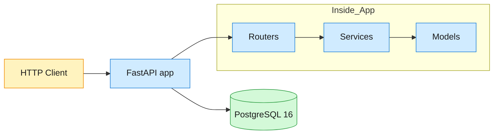

# Strava MVP — Design

> Full system design: [System Design: Strava (v3)](https://app.notion.com/p/System-Design-Strava-v2-38ad865005a881148120f7c05f68267a)

## Architecture

Monolithic REST API. The FastAPI application serves all endpoints from a single
process, backed by PostgreSQL 16 over async SQLAlchemy 2.0. Alembic migrations
run automatically on startup.



### Key decisions

| Decision | Choice | Rationale |
|---|---|---|
| GPS storage | JSONB column | No streaming infrastructure needed; polyline is structured and queryable |
| Leaderboard | PostgreSQL indexed query | `(segment_id, elapsed_time ASC, effort_id ASC)` covers the query at MVP scale |
| Kudos idempotency | PK + `ON CONFLICT DO NOTHING` | Atomic at DB level; rowcount distinguishes 201 vs 200 |
| Kudos counter | Denormalized `kudos_count` | Updated atomically in same tx; avoids COUNT on every activity view |
| Effort uniqueness | `UNIQUE (activity_id, segment_id)` | DB constraint is race-free; returns 409 on conflict |
| PK type | UUID v4 | No coordination needed; safe for horizontal scaling |
| Layering | Routers → Services → Models | Routers are thin; business logic lives in services |

## Data Model

All tables use UUID primary keys. Counters are denormalized. Polyline columns
store `[[lat, lng, alt, ts], ...]` as JSONB.

```sql
CREATE TABLE users (
    user_id      UUID PRIMARY KEY DEFAULT gen_random_uuid(),
    display_name TEXT NOT NULL,
    created_at   TIMESTAMPTZ NOT NULL DEFAULT now()
);

CREATE TABLE activities (
    activity_id      UUID PRIMARY KEY DEFAULT gen_random_uuid(),
    user_id          UUID NOT NULL REFERENCES users(user_id),
    sport_type       VARCHAR(10) NOT NULL CHECK (sport_type IN ('run','ride','swim','hike','walk','other')),
    start_time       TIMESTAMPTZ NOT NULL,
    elapsed_time     INTEGER NOT NULL CHECK (elapsed_time > 0),
    distance_m       DOUBLE PRECISION NOT NULL CHECK (distance_m >= 0),
    elevation_gain_m DOUBLE PRECISION NOT NULL DEFAULT 0 CHECK (elevation_gain_m >= 0),
    polyline         JSONB NOT NULL,
    visibility       VARCHAR(10) NOT NULL DEFAULT 'everyone'
                     CHECK (visibility IN ('everyone','followers','only_me')),
    kudos_count      INTEGER NOT NULL DEFAULT 0,
    created_at       TIMESTAMPTZ NOT NULL DEFAULT now()
);
CREATE INDEX idx_activities_user_created ON activities(user_id, created_at DESC);

CREATE TABLE segments (
    segment_id    UUID PRIMARY KEY DEFAULT gen_random_uuid(),
    name          TEXT NOT NULL,
    polyline      JSONB NOT NULL,
    distance_m    DOUBLE PRECISION NOT NULL CHECK (distance_m >= 0),
    total_efforts INTEGER NOT NULL DEFAULT 0,
    created_at    TIMESTAMPTZ NOT NULL DEFAULT now()
);

CREATE TABLE segment_efforts (
    effort_id    UUID PRIMARY KEY DEFAULT gen_random_uuid(),
    segment_id   UUID NOT NULL REFERENCES segments(segment_id),
    activity_id  UUID NOT NULL REFERENCES activities(activity_id),
    user_id      UUID NOT NULL REFERENCES users(user_id),
    elapsed_time INTEGER NOT NULL CHECK (elapsed_time > 0),
    created_at   TIMESTAMPTZ NOT NULL DEFAULT now(),
    UNIQUE (activity_id, segment_id)
);
CREATE INDEX idx_efforts_leaderboard ON segment_efforts(segment_id, elapsed_time ASC, effort_id ASC);

CREATE TABLE kudos (
    activity_id UUID NOT NULL REFERENCES activities(activity_id),
    user_id     UUID NOT NULL REFERENCES users(user_id),
    created_at  TIMESTAMPTZ NOT NULL DEFAULT now(),
    PRIMARY KEY (activity_id, user_id)
);
```

## API Endpoints

All responses are JSON. All IDs are UUIDv4 strings. All timestamps are ISO 8601.

### `POST /users` — Create user

```
Request:  {"display_name": "Alice"}
Response: 201 {"user_id": "<uuid>", "display_name": "Alice", "created_at": "<iso>"}
Errors:   422 — missing display_name
```

### `POST /activities` — Create activity (FR-1)

```
Request:  {"user_id": "<uuid>", "sport_type": "run", "start_time": "<iso>",
           "elapsed_time": 1800, "distance_m": 5000.0, "polyline": [[lat,lng,alt,ts], ...],
           "elevation_gain_m": 50.0, "visibility": "everyone"}
Response: 201 {"activity_id": "<uuid>"}
Errors:   422 — missing required fields, invalid sport_type, negative distance, empty polyline
          404 — user_id does not exist
```

### `GET /activities/{activity_id}` — Get activity detail (FR-2)

```
Response: 200 {full activity with all fields including polyline and kudos_count}
Errors:   404 — activity not found
```

### `GET /users/{user_id}/activities` — List user activities (FR-3)

```
Query:    ?limit=20&offset=0  (limit max 100)
Response: 200 [{activity}, ...]  or  200 [] if none
Errors:   404 — user not found
```

Ordered by `created_at DESC` (newest first).

### `POST /segments` — Create segment (FR-4)

```
Request:  {"name": "Hill Climb", "polyline": [[lat,lng,alt,ts], ...], "distance_m": 1200.0}
Response: 201 {"segment_id": "<uuid>"}
Errors:   422 — missing name, polyline, or distance_m
```

### `GET /segments/{segment_id}` — Get segment detail

```
Response: 200 {segment with all fields including total_efforts}
Errors:   404 — segment not found
```

### `POST /segment-efforts` — Record segment effort (FR-5)

```
Request:  {"activity_id": "<uuid>", "segment_id": "<uuid>", "user_id": "<uuid>",
           "elapsed_time": 305}
Response: 201 {"effort_id": "<uuid>", ...}
Errors:   404 — activity or segment not found
          409 — duplicate (activity_id, segment_id) pair
          422 — missing required fields
```

### `GET /segments/{segment_id}/leaderboard` — Leaderboard (FR-6)

```
Query:    ?limit=10  (max 100)
Response: 200 [{"rank": 1, "user_id": "<uuid>", "activity_id": "<uuid>",
                "elapsed_time": 280}, ...]
          200 [] if no efforts
Errors:   404 — segment not found
```

Ordered by `elapsed_time ASC`. Tiebreaker: `effort_id ASC`.

### `POST /activities/{activity_id}/kudos` — Give kudos (FR-7)

```
Request:  {"user_id": "<uuid>"}
Response: 201 {"status": "created"}        — first time
          200 {"status": "already_exists"} — idempotent
Errors:   404 — activity not found
          422 — missing user_id
```

### `GET /activities/{activity_id}/kudos` — List kudos (FR-7)

```
Response: 200 [{"user_id": "<uuid>", "created_at": "<iso>"}, ...]
          200 [] if no kudos
Errors:   404 — activity not found
```

### `GET /healthz` — Health check (FR-8)

```
Response: 200 {"status": "ok"}
          503 {"status": "degraded", "detail": "database unreachable"}
```

## Functional Requirements ↔ Acceptance Tests

| FR | Requirement | Acceptance test |
|----|-------------|-----------------|
| FR-1 | Create activity with GPS polyline and metadata | `verify/acceptance/test_fr1_create_activity.py` |
| FR-2 | Get activity detail by ID | `verify/acceptance/test_fr2_get_activity.py` |
| FR-3 | List user activities (paginated, reverse-chronological) | `verify/acceptance/test_fr3_list_activities.py` |
| FR-4 | Create a named segment with bounding polyline | `verify/acceptance/test_fr4_create_segment.py` |
| FR-5 | Record segment effort; reject duplicates (409) | `verify/acceptance/test_fr5_record_effort.py` |
| FR-6 | Get segment leaderboard (top-N by time, ranked) | `verify/acceptance/test_fr6_segment_leaderboard.py` |
| FR-7 | Give kudos (idempotent); list kudos | `verify/acceptance/test_fr7_kudos.py` |
| FR-8 | Health check with DB connectivity | `verify/acceptance/test_fr8_healthz.py` |
